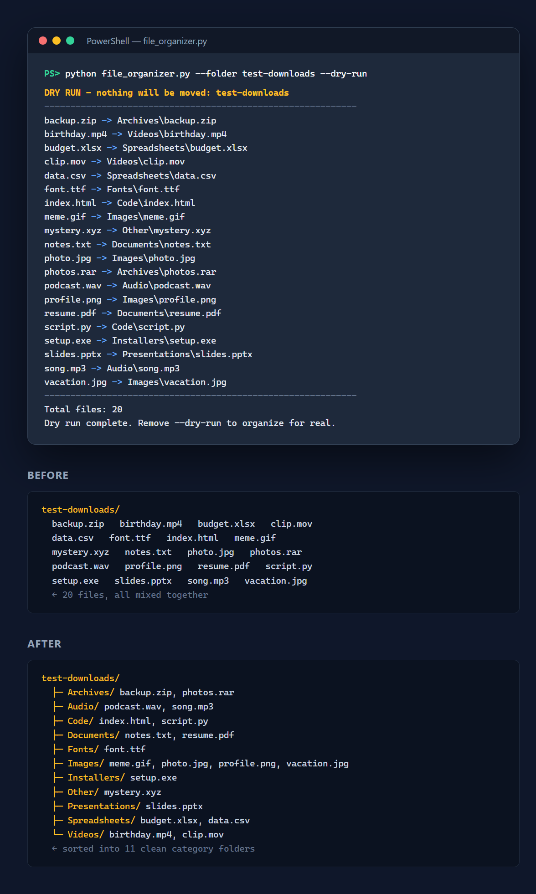

# 📁 File Organizer

A Python tool that automatically organizes a messy folder (like Downloads) into clean, categorized subfolders — Images, Documents, Videos, Audio, Code, and more.

## 📸 Screenshot



## ✨ Features

- **14 smart categories** based on file extension
- **Dry-run mode** — preview every move before anything happens
- **Undo mode** — put everything back with one command
- **Collision-safe** — never overwrites; renames duplicates as `file (1).ext`
- **Full audit log** — every action saved to JSON

## 🚀 Usage

```bash
# Preview what will be moved (safe)
python file_organizer.py --folder "C:\Users\You\Downloads" --dry-run

# Organize for real
python file_organizer.py --folder "C:\Users\You\Downloads"

# Undo the last run
python file_organizer.py --folder "C:\Users\You\Downloads" --undo
```

If no `--folder` is given, it organizes your Downloads folder by default.

## 🔧 Requirements

- Python 3.10+ (no third-party packages needed — standard library only)

## 📂 Categories

Images, Documents, Spreadsheets, Presentations, Videos, Audio, Archives, Code, Installers, Fonts, Other.

## ⚠️ Safety

- Only files directly inside the target folder are moved (subfolders untouched)
- Hidden files (starting with `.`) are skipped
- Name collisions are handled by auto-renaming — nothing is ever overwritten
